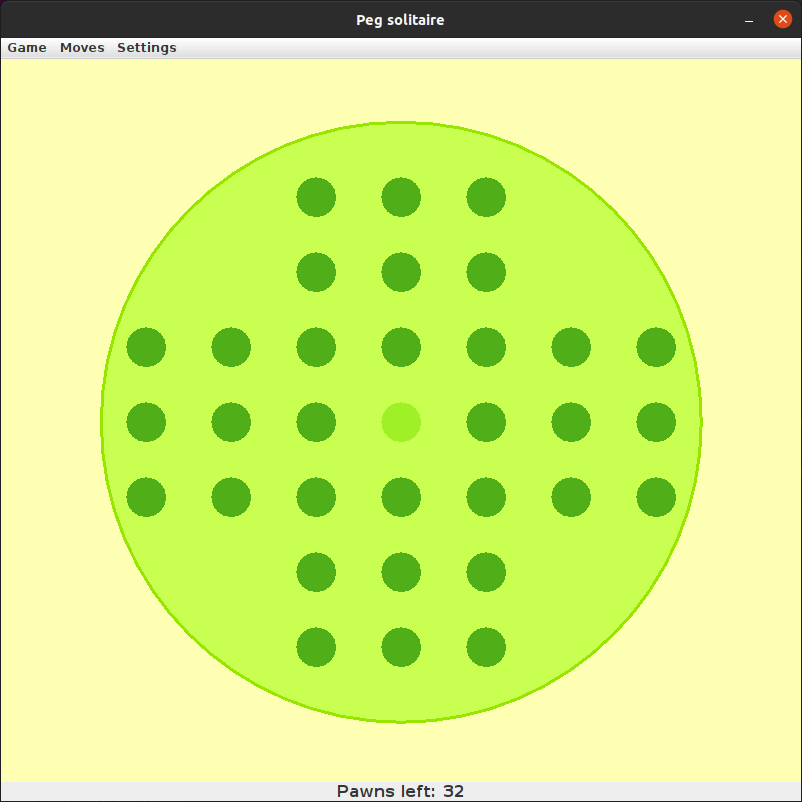

# Peg-solitare
Simple game created in Java Swing.

### Compile & run
`javac src/* -d out/production/peg-solitaire`

`java -classpath out/production/peg-solitaire/ Main`

### Gameplay
According to [Wikipedia](https://en.wikipedia.org/wiki/Peg_solitaire#Play):
*A valid move is to jump a peg orthogonally over an adjacent peg into a hole two positions away and then to remove the jumped peg*

### Features
Jump can be done in 3 ways:
* Left click on pawn, then left click on destination field
* Right click on pawn, then select jump direction from submenu
* Using menu: Moves -> Select, select pawn using arrows, Moves -> Make jump and finally select jump direction from submenu

You can switch between european and british board, but it's possible only before start of the game.